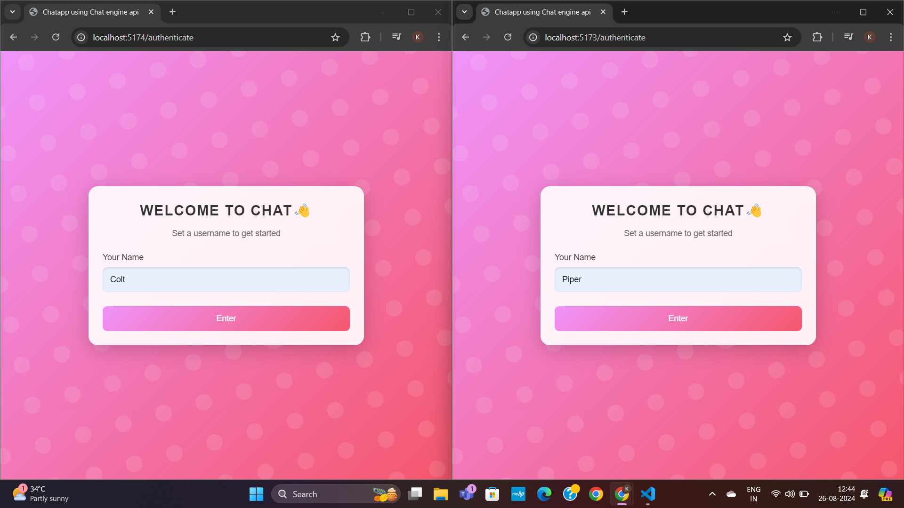
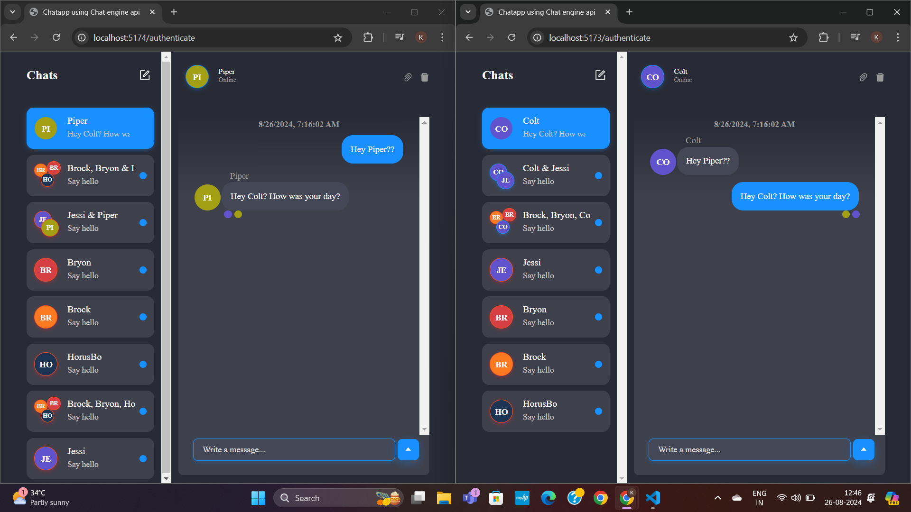
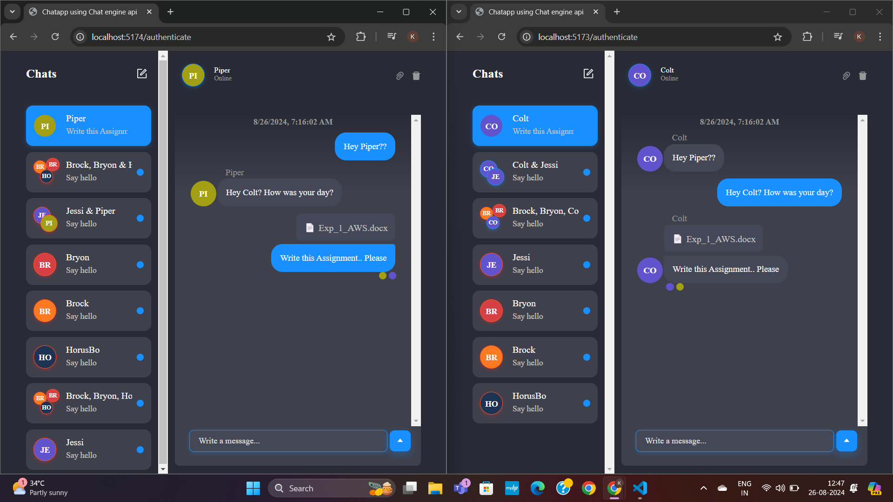
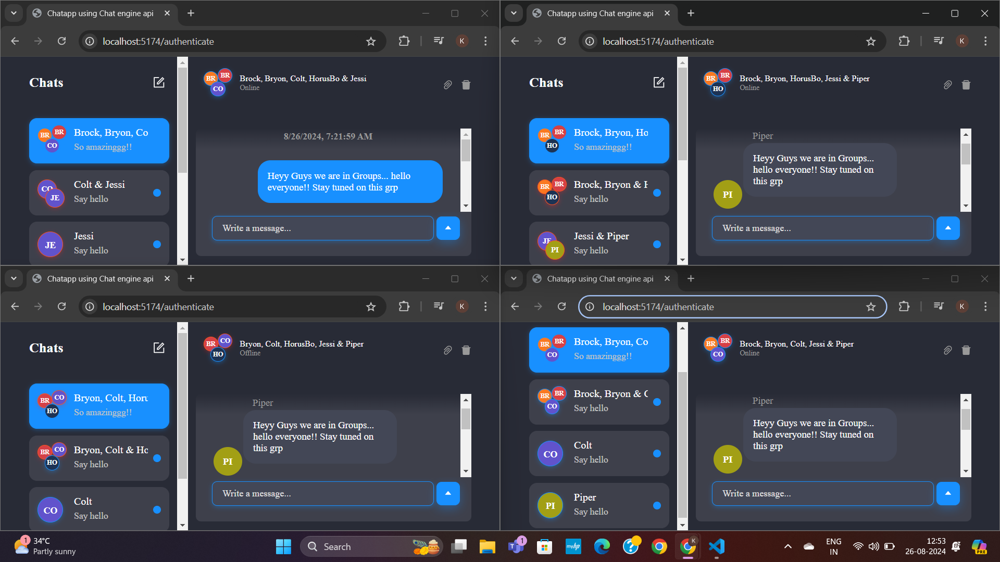
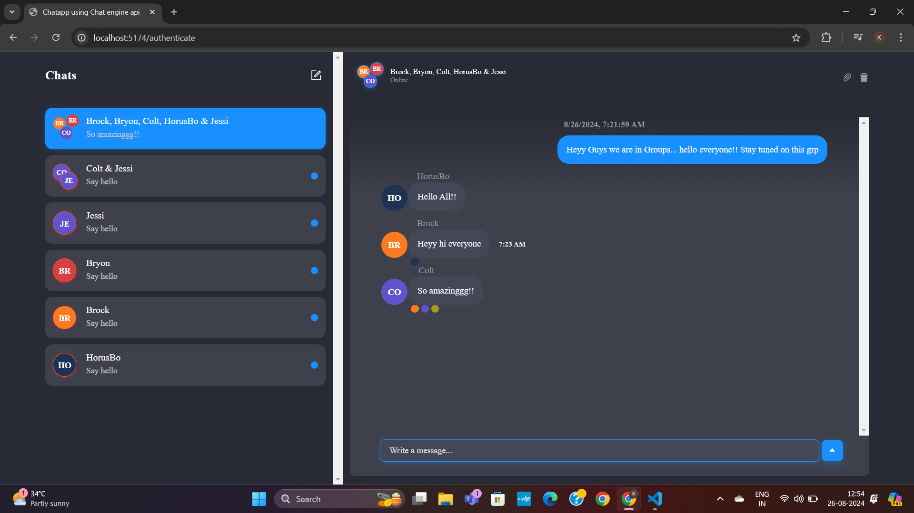
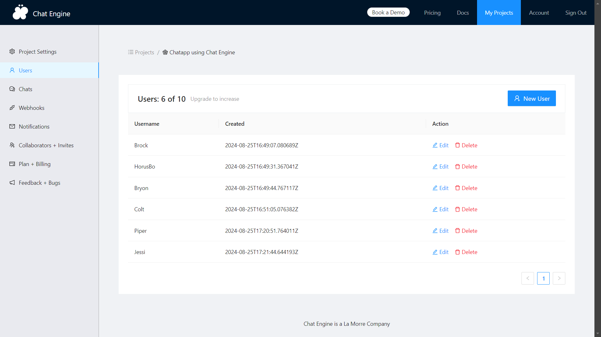

# ChatApp Using Chat Engine API - Nodejs, ExpressJs

This is a chat application built using the [Chat Engine API](https://chatengine.io/). The app allows users to set their names, participate in live chats, and more. The UI is created using the `react-chat-engine-pretty` and `react-chat-engine-advanced` packages.

## Features

- User authentication and name setting
- Real-time messaging
- Sending pictures and creating group chats
- Customizable and responsive UI

## Tech Stack

- **Frontend**: React, CSS, `react-chat-engine-pretty`, `react-chat-engine-advanced`
- **Backend**: Chat Engine API, Express, Nodejs
- **Package Manager**: npm

## Setup

### Prerequisites

Make sure you have [Node.js](https://nodejs.org/) and npm installed on your machine.

### Installation

1. Clone the repository:
   ```bash
   git clone https://github.com/yourusername/chatapp.git
   cd chatapp

2. Install dependencies:
   npm install

3. Create a .env file in the root directory and add your Chat Engine API credentials:

REACT_APP_PROJECT_ID=your_project_id
REACT_APP_PRIVATE_KEY=your_private_key 

4. Run the backend:
npm start

5. Run the frontend:
npm run dev

6. Open your browser and navigate to http://localhost:3001/authentication to see the app in action.

## Screenshots

1. **Chat Initializing**
   

2. **Messaging to One-to-One**
   

3. **Sharing Docs, Files, etc.**
   

4. **Creating Groups**
   

5. **Group Messages**
   

6. **Storing Users**
   

   ## THANKYOU! ##


